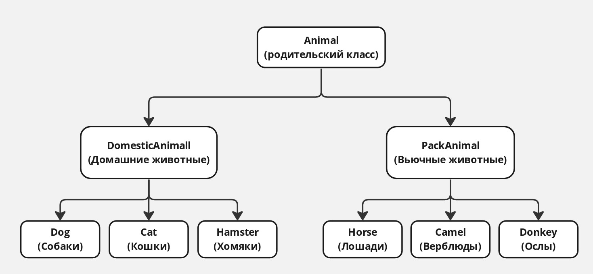

## Задание

### 1. Используя команду cat в терминале операционной системы Linux, создать два файла Домашние животные (заполнив файл собаками, кошками, хомяками) и Вьючные животными (заполнив файл Лошадьми, верблюдами и ослы), а затем объединить их. Просмотреть содержимое созданного файла.
Переименовать файл, дав ему новое имя (Друзья человека).

```sh
echo -e "Собаки\nКошки\nХомяки" > Домашние_животные.txt
```
```sh
cat Домашние_животные.txt
```
```sh
echo -e "Лошади\nВерблюды\nОслы" > Вьючные_животные.txt
```
```sh
cat Вьючные_животные.txt
```
```sh
cat Домашние_животные.txt Вьючные_животные.txt > Животные.txt
```
```sh
cat Животные.txt
```

### 2. Создать директорию, переместить файл туда.
```sh
mkdir Мои_файлы
```
```sh
mv Друзья_человека.txt Мои_файлы/
```

### 3. Подключить дополнительный репозиторий MySQL. Установить любой пакет из этого репозитория.
```sh
sudo apt-get install wget
wget https://dev.mysql.com/get/mysql-apt-config_0.8.17-1_all.deb
sudo dpkg -i mysql-apt-config_0.8.17-1_all.deb
sudo apt-get update
```
```sh
sudo apt-get install mysql-server
```

### 4. Установить и удалить deb-пакет с помощью dpkg.
#### Скачивание пакета
```sh
wget http://archive.ubuntu.com/ubuntu/pool/universe/c/cowsay/cowsay_3.03+dfsg2-7_all.deb
```
#### Установка пакета
```sh
dpkg -i cowsay_3.03+dfsg2-7_all.deb
```
#### Исправление зависимостей, если необходимо
```sh
sudo apt-get install -f
```
#### Проверка установки пакета
```sh
cowsay "Hello, World!"
```
#### Удаление пакета
```sh
dpkg -r cowsay
```
#### Полное удаление пакета с конфигурационными файлами
```sh
dpkg -P cowsay
```

### 5. Выложить историю команд в терминале ubuntu
```sh
history
```
```
 history

    1  echo -e "Собаки\nКошки\nХомяки" > Домашние_животные.txt\n
    2  ll
    3  cat Домашние_животные.txt
    4  echo -e "Лошади\nВерблюды\nОслы" > Вьючные_животные.txt\n
    5  cat Вьючные_животные.txt
    6  cat Домашние_животные.txt Вьючные_животные.txt > Животные.txt
    7  cat Животные.txt
    8  mv Животные.txt Друзья_человека.txt\n
    9  ll
   10  cat Друзья_человека.txt
   11  mkdir Мои_файлы\n
   12  ll
   13  mv Друзья_человека.txt Мои_файлы/\n
   14  cd Мои_файлы
   15  дд
   16  ll
   17  apt-get install wget
   18  wget https://dev.mysql.com/get/mysql-apt-config_0.8.17-1_all.deb
   19  dpkg -i mysql-apt-config_0.8.17-1_all.deb
   20  apt-get update
   21  sudo apt-get install mysql-server\n
   22  wget http://security.ubuntu.com/ubuntu/pool/universe/h/htop/htop_2.2.0-1_amd64.deb
   23  wget https://download.anydesk.com/linux/anydesk_6.2.1-1_amd64.deb
   24  https://download.anydesk.com/linux/anydesk_6.3.2-1_amd64.deb
   25  wget https://download.anydesk.com/linux/anydesk_6.3.2-1_amd64.deb
   26  sudo dpkg -i anydesk_6.3.2-1_amd64.deb
   27  wget http://archive.ubuntu.com/ubuntu/pool/universe/c/cowsay/cowsay_3.03+dfsg2-7_all.deb\n
   28  dpkg -i cowsay_3.03+dfsg2-7_all.deb
   29  sudo apt-get install -f\n
   30  cowsay "Hello, World\n\nq
   31  cowsay "Hello, World\nHel
   32  dpkg -i cowsay_3.03+dfsg2-7_all.deb
   33  cowsay "Hello, World\nHel
   34  cowsay "Hello, World\nhdferf
   35  cowsay "Hello, World"
   36  cowsay --version
   37  sudo dpkg -r cowsay
   38  dpkg -P cowsay
   39  history > history.txt\n
   40  ll
```

### 6. Нарисовать диаграмму, в которой есть класс родительский класс, домашние животные и вьючные животные, в составы которых в случае домашних животных войдут классы: собаки, кошки, хомяки, а в класс вьючные животные войдут: Лошади, верблюды и ослы).

Ссылка на [диаграмму](https://miro.com/app/board/uXjVKFKHgyg=/?share_link_id=741156565085).



### 7. В подключенном MySQL репозитории создать базу данных “Друзья человека”
- Создание базы	данных "Друзья человека":
```sh
CREATE SCHEMA `human_friends`;
```
### 8. Создать таблицы с иерархией из диаграммы в БД
- Выбираем базу "Друзья человека":
```sh
USE human_friends;
```
- Создание таблицы для родительского класса (Animal):
```sh
CREATE TABLE Animal (
    id INT AUTO_INCREMENT PRIMARY KEY,
    name VARCHAR(50) NOT NULL
);
```
- Создание таблицы для домашних животных (DomesticAnimall):
```sh
CREATE TABLE DomesticAnimall (
    id INT AUTO_INCREMENT PRIMARY KEY,
    parent_id INT,
    name VARCHAR(50) NOT NULL,
    FOREIGN KEY (parent_id) REFERENCES Animal(id)
);
```
- Создание таблицы для вьючных животных (PackAnimal):
```sh
CREATE TABLE PackAnimal (
    id INT AUTO_INCREMENT PRIMARY KEY,
    parent_id INT,
    name VARCHAR(50) NOT NULL,
    FOREIGN KEY (parent_id) REFERENCES Animal(id)
);
```
- Создание таблицы для собак (Dog):
```sh
CREATE TABLE Dog (
    id INT AUTO_INCREMENT PRIMARY KEY,
    parent_id INT,
    name VARCHAR(50) NOT NULL,
    commands TEXT,
    birth_date DATE,
    FOREIGN KEY (parent_id) REFERENCES DomesticAnimall(id)
);
```
- Создание таблицы для кошек (Cat):
```sh
CREATE TABLE Cat (
    id INT AUTO_INCREMENT PRIMARY KEY,
    parent_id INT,
    name VARCHAR(50) NOT NULL,
    commands TEXT,
    birth_date DATE,
    FOREIGN KEY (parent_id) REFERENCES DomesticAnimall(id)
);
```
- Создание таблицы для хомяков (Hamster): 
```sh
CREATE TABLE Hamster (
    id INT AUTO_INCREMENT PRIMARY KEY,
    parent_id INT,
    name VARCHAR(50) NOT NULL,
    commands TEXT,
    birth_date DATE,
    FOREIGN KEY (parent_id) REFERENCES DomesticAnimall(id)
);
```
Создание таблицы для лошадей (Horse):
```sh
CREATE TABLE Horse (
    id INT AUTO_INCREMENT PRIMARY KEY,
    parent_id INT,
    name VARCHAR(50) NOT NULL,
    commands TEXT,
    birth_date DATE,
    FOREIGN KEY (parent_id) REFERENCES PackAnimal(id)
);
```
- Создание таблицы для верблюдов (Camel):
```sh
CREATE TABLE Camel (
    id INT AUTO_INCREMENT PRIMARY KEY,
    parent_id INT,
    name VARCHAR(50) NOT NULL,
    commands TEXT,
    birth_date DATE,
    FOREIGN KEY (parent_id) REFERENCES PackAnimal(id)
);
```
- Создание таблицы для ослов (Donkey):
```sh
CREATE TABLE Donkey (
    id INT AUTO_INCREMENT PRIMARY KEY,
    parent_id INT,
    name VARCHAR(50) NOT NULL,
    commands TEXT,
    birth_date DATE,
    FOREIGN KEY (parent_id) REFERENCES PackAnimal(id)
);
```
### 9. Заполнить низкоуровневые таблицы именами(животных), командами которые они выполняют и датами рождения
- Выбираем базу данных:
```sh
USE human_friends;
```
- Вставка записей в таблицу "Родительский класс" (Animal):
```sh
INSERT INTO Animal (name) VALUES ('Животные');
```
- Вставка записей в таблицу "Домашние животные" (DomesticAnimall):
```sh
INSERT INTO DomesticAnimall (parent_id, name) VALUES (1, 'Домашние животные');
```
- Вставка записей в таблицу "Вьючные животные" (PackAnimal):
```sh
INSERT INTO PackAnimal (parent_id, name) VALUES (1, 'Вьючные животные');
```
- Вставка записей в таблицу "Собаки" (Dog):
```sh
INSERT INTO Dog (parent_id, name, commands, birth_date) VALUES 
((SELECT id FROM DomesticAnimall WHERE name='Домашние животные'), 'Шарик', 'сидеть, лежать', '2021-03-01'),
((SELECT id FROM DomesticAnimall WHERE name='Домашние животные'), 'Бобик', 'апорт, голос', '2022-05-10');
```
- Вставка записей в таблицу "Кошки" (Cat):
```sh
INSERT INTO Cat (parent_id, name, commands, birth_date) VALUES 
((SELECT id FROM DomesticAnimall WHERE name='Домашние животные'), 'Мурка', 'мяукать, прыгать', '2020-06-15'),
((SELECT id FROM DomesticAnimall WHERE name='Домашние животные'), 'Барсик', 'ловить мышей, мурлыкать', '2021-07-21');
```
- Вставка записей в таблицу "Хомяки" (Hamster):
```sh
INSERT INTO Hamster (parent_id, name, commands, birth_date) VALUES 
((SELECT id FROM DomesticAnimall WHERE name='Домашние животные'), 'Хома', 'бегать', '2022-01-05'),
((SELECT id FROM DomesticAnimall WHERE name='Домашние животные'), 'Снежок', 'прятаться', '2023-02-14');
```
- Вставка записей в таблицу "Лошади" (Horse):
```sh
INSERT INTO Horse (parent_id, name, commands, birth_date) VALUES 
((SELECT id FROM PackAnimal WHERE name='Вьючные животные'), 'Буцефал', 'бегать, прыгать', '2019-04-20'),
((SELECT id FROM PackAnimal WHERE name='Вьючные животные'), 'Пегас', 'летать, галопировать', '2020-11-30');
```
- Вставка записей в таблицу "Верблюды" (Camel):
```sh
INSERT INTO Camel (parent_id, name, commands, birth_date) VALUES 
((SELECT id FROM PackAnimal WHERE name='Вьючные животные'), 'Верблюд', 'носить грузы', '2018-02-18'),
((SELECT id FROM PackAnimal WHERE name='Вьючные животные'), 'Караван', 'идти далеко, носить поклажу', '2017-08-25');
```
- Вставка записей в таблицу "Ослы" (Donkey):
```sh
INSERT INTO Donkey (parent_id, name, commands, birth_date) VALUES 
((SELECT id FROM PackAnimal WHERE name='Вьючные животные'), 'Осел', 'нести поклажу', '2020-09-09'),
((SELECT id FROM PackAnimal WHERE name='Вьючные животные'), 'Джек', 'блеять, перевозить грузы', '2019-12-15');
```

- Проверка данных:
```sh
SELECT * FROM Dog;
SELECT * FROM Cat;
SELECT * FROM Hamster;
SELECT * FROM Horse;
SELECT * FROM Camel;
SELECT * FROM Donkey;
```

### 10. Удалив из таблицы верблюдов, т.к. верблюдов решили перевезти в другой питомник на зимовку. Объединить таблицы лошади, и ослы в одну таблицу.
- Удаление данных из таблицы "Верблюды" (Camel):
```sh
DELETE FROM Camel;
```

- Объединение таблиц лошадей и ослов:
```sh
CREATE TABLE Horse_and_Donkey AS
SELECT * FROM Horse
UNION
SELECT * FROM Donkey;
```

### 11.Создать новую таблицу “молодые животные” в которую попадут все животные старше 1 года, но младше 3 лет и в отдельном столбце с точностью до месяца подсчитать возраст животных в новой таблице
- Создание новой таблицы "молодые животные" (YoungAnimals):
```sh
CREATE TABLE YoungAnimals AS
SELECT *, TIMESTAMPDIFF(MONTH, birth_date, CURDATE()) AS age_in_months
FROM (SELECT * FROM Dog   
      UNION
      SELECT * FROM Cat
      UNION
      SELECT * FROM Hamster
      UNION
      SELECT * FROM Horse 
      UNION
      SELECT * FROM Donkey) AS all_animals
WHERE TIMESTAMPDIFF(YEAR, birth_date, CURDATE()) BETWEEN 1 AND 3;
```

### 12. Объединить все таблицы в одну, при этом сохраняя поля, указывающие на прошлую принадлежность к старым таблицам.
- Объединение всех таблиц:
```sh
CREATE TABLE AllAnimals AS
SELECT 'Dog' AS source_table, id, name, commands, birth_date FROM Dog
UNION ALL
SELECT 'Cat' AS source_table, id, name, commands, birth_date FROM Cat
UNION ALL
SELECT 'Hamster' AS source_table, id, name, commands, birth_date FROM Hamster
UNION ALL
SELECT 'Horse' AS source_table, id, name, commands, birth_date FROM Horse
UNION ALL
SELECT 'Donkey' AS source_table, id, name, commands, birth_date FROM Donkey;
```

### 13.Создать класс с Инкапсуляцией методов и наследованием по диаграмме.
- Код на языке програмирования Python:
```sh
class DomesticAnimal:
    def __init__(self, name):
        self._name = name

    def get_name(self):
        return self._name

    def make_sound(self):
        pass  # Реализация в подклассах


class Dog(DomesticAnimal):
    def make_sound(self):
        return "Гав!"


class Cat(DomesticAnimal):
    def make_sound(self):
        return "Мяу!"


class Hamster(DomesticAnimal):
    def make_sound(self):
        return "Скрип Скрип!"


class PackAnimal:
    def __init__(self, name):
        self._name = name

    def get_name(self):
        return self._name

    def carry_load(self):
        pass  # Реализация в подклассах


class Horse(PackAnimal):
    def carry_load(self):
        return "Цок Цок!"


class Camel(PackAnimal):
    def carry_load(self):
        return "Шлёп шлёп шлёп!"


class Donkey(PackAnimal):
    def carry_load(self):
        return "Иа!"


def main():
    # Создание экземпляров домашних животных
    dog = Dog("Шарик")
    cat = Cat("Мурка")
    hamster = Hamster("Хома")

    # Создание экземпляров вьючных животных
    horse = Horse("Буцефал")
    camel = Camel("Верблюд")
    donkey = Donkey("Джек")

    # Список всех животных
    animals = [dog, cat, hamster, horse, camel, donkey]

    # Перебор списка животных
    for animal in animals:
        if isinstance(animal, DomesticAnimal):
            animal_type = "Домашнее животное"
            print(f"{animal.get_name()} это {animal_type}. Звук: {animal.make_sound()}")
        elif isinstance(animal, PackAnimal):
            animal_type = "Вьючное животное"
            print(f"{animal.get_name()} это {animal_type}.")
            print(animal.carry_load())

if __name__ == "__main__":
    main()
```

### 14. Написать программу, имитирующую работу реестра домашних животных. В программе должен быть реализован следующий функционал:
### 14.1 Завести новое животное
```sh
dog = Dog("Бобик")
registry.add_animal(dog)
```
### 14.2 определять животное в правильный класс
```sh
print(registry.classify_animal(cat))  # Выведет "Кошка"
```
### 14.3 увидеть список команд, которое выполняет животное
```sh
print(registry.list_commands(hamster))  # Выведет "Бегать в колесе, Есть семечки"
```
### 14.4 обучить животное новым командам
```sh
new_commands = ["Фас!", "Искусственное дыхание"]
registry.teach_commands(dog, new_commands)
print(registry.list_commands(dog))  # Выведет "Сидеть, Лежать, Фас!, Искусственное дыхание"
```
### 14.5 Реализовать навигацию по меню
```sh
def main():
    registry = AnimalRegistry()

    while True:
        print("1. Завести новое животное")
        print("2. Определить класс животного")
        print("3. Увидеть список команд, которые выполняет животное")
        print("4. Обучить животное новым командам")
        print("5. Выход")

        choice = input("Выберите действие: ")

        if choice == "1":
            # Логика добавления нового животного
            pass
        elif choice == "2":
            # Логика определения класса животного
            pass
        elif choice == "3":
            # Логика вывода списка команд животного
            pass
        elif choice == "4":
            # Логика обучения животного новым командам
            pass
        elif choice == "5":
            break
        else:
            print("Некорректный ввод")

if __name__ == "__main__":
    main()
```
- Полный код:
```sh
class Animal:
    def __init__(self, name):
        self.name = name
        self.commands = []

    def add_commands(self, new_commands):
        self.commands.extend(new_commands)


class Dog(Animal):
    def __init__(self, name):
        super().__init__(name)

    def get_class(self):
        return "Собака"


class Cat(Animal):
    def __init__(self, name):
        super().__init__(name)

    def get_class(self):
        return "Кошка"


class Hamster(Animal):
    def __init__(self, name):
        super().__init__(name)

    def get_class(self):
        return "Хомяк"


class AnimalRegistry:
    def __init__(self):
        self.animals = []

    def add_animal(self, animal):
        self.animals.append(animal)

    def classify_animal(self, animal):
        return animal.get_class()

    def list_commands(self, animal):
        return animal.commands

    def teach_commands(self, animal, new_commands):
        animal.add_commands(new_commands)


def main():
    registry = AnimalRegistry()

    while True:
        print("1. Завести новое животное")
        print("2. Определить класс животного")
        print("3. Увидеть список команд, которые выполняет животное")
        print("4. Обучить животное новым командам")
        print("5. Выход")

        choice = input("Выберите действие: ")

        if choice == "1":
            name = input("Введите имя нового животного: ")
            animal_type = input("Введите тип животного (Собака, Кошка, Хомяк): ")
            if animal_type == "Собака":
                animal = Dog(name)
            elif animal_type == "Кошка":
                animal = Cat(name)
            elif animal_type == "Хомяк":
                animal = Hamster(name)
            else:
                print("Некорректный тип животного")
                continue
            registry.add_animal(animal)
            print("Животное успешно добавлено!")

        elif choice == "2":
            name = input("Введите имя животного: ")
            animal = next((a for a in registry.animals if a.name == name), None)
            if animal:
                print(registry.classify_animal(animal))
            else:
                print("Животное не найдено")

        elif choice == "3":
            name = input("Введите имя животного: ")
            animal = next((a for a in registry.animals if a.name == name), None)
            if animal:
                print(registry.list_commands(animal))
            else:
                print("Животное не найдено")

        elif choice == "4":
            name = input("Введите имя животного: ")
            animal = next((a for a in registry.animals if a.name == name), None)
            if animal:
                new_commands = input("Введите новые команды через запятую: ").split(",")
                registry.teach_commands(animal, new_commands)
                print("Команды успешно добавлены!")
            else:
                print("Животное не найдено")

        elif choice == "5":
            break

        else:
            print("Некорректный ввод")


if __name__ == "__main__":
    main()
```

### 15. Создайте класс Счетчик, у которого есть метод add(), увеличивающий̆ значение внутренней̆int переменной̆на 1 при нажатие “Завести новое животное” Сделайте так, чтобы с объектом такого 
### типа можно было работать в блоке try-with-resources. Нужно бросить исключение, если работа с объектом типа счетчик была не в ресурсном try и/или ресурс остался открыт. Значение считать 
### в ресурсе try, если при заведения животного заполнены все поля.
```sh
class Animal:
    def __init__(self, name):
        self.name = name
        self.commands = []

    def add_commands(self, new_commands):
        self.commands.extend(new_commands)

    @staticmethod
    def get_class():
        return "Животное"


class Dog(Animal):
    def __init__(self, name):
        super().__init__(name)

    @staticmethod
    def get_class():
        return "Собака"


class Cat(Animal):
    def __init__(self, name):
        super().__init__(name)

    @staticmethod
    def get_class():
        return "Кошка"


class Hamster(Animal):
    def __init__(self, name):
        super().__init__(name)

    @staticmethod
    def get_class():
        return "Хомяк"


class AnimalRegistry:
    def __init__(self):
        self.animals = []

    def add_animal(self, animal):
        self.animals.append(animal)

    @staticmethod
    def classify_animal(animal):
        return animal.get_class()

    @staticmethod
    def list_commands(animal):
        return animal.commands

    @staticmethod
    def teach_commands(animal, new_commands):
        animal.add_commands(new_commands)


class Counter:
    def __init__(self):
        self.value = 0

    def add(self):
        self.value += 1

    def __enter__(self):
        return self

    def __exit__(self, exc_type, exc_value, traceback):
        if exc_type is not None:
            return False  # Пропускаем исключения, чтобы передать их наружу
        if self.value > 0:
            raise RuntimeError("Счетчик не был обнулен")  # Вызываем исключение, если счетчик не был обнулен


def main():
    try:
        with Counter() as counter:
            registry = AnimalRegistry()

            while True:
                print("\n1. Завести новое животное")
                print("2. Определить класс животного")
                print("3. Увидеть список команд, которые выполняет животное")
                print("4. Обучить животное новым командам")
                print("5. Выход")

                choice = input("Выберите действие: ")

                if choice == "1":
                    name = input("Введите имя нового животного: ").strip()
                    animal_type = input("Введите тип животного (Собака, Кошка, Хомяк): ").strip()

                    if not name or not animal_type:
                        print("Имя и тип животного не могут быть пустыми.")
                        continue

                    if animal_type.lower() == "собака":
                        animal = Dog(name)
                    elif animal_type.lower() == "кошка":
                        animal = Cat(name)
                    elif animal_type.lower() == "хомяк":
                        animal = Hamster(name)
                    else:
                        print("Некорректный тип животного")
                        continue

                    registry.add_animal(animal)
                    counter.add()  # Увеличиваем значение счетчика

                    print(f"Животное '{name}' успешно добавлено!")

                elif choice == "2":
                    name = input("Введите имя животного: ").strip()
                    animal = next((a for a in registry.animals if a.name == name), None)
                    if animal:
                        print(f"{name} это {registry.classify_animal(animal)}")
                    else:
                        print("Животное не найдено")

                elif choice == "3":
                    name = input("Введите имя животного: ").strip()
                    animal = next((a for a in registry.animals if a.name == name), None)
                    if animal:
                        commands = registry.list_commands(animal)
                        if commands:
                            print(f"Команды, которые выполняет {name}: {', '.join(commands)}")
                        else:
                            print(f"{name} не знает никаких команд")
                    else:
                        print("Животное не найдено")

                elif choice == "4":
                    name = input("Введите имя животного: ").strip()
                    animal = next((a for a in registry.animals if a.name == name), None)
                    if animal:
                        new_commands = input("Введите новые команды через запятую: ").strip().split(",")
                        new_commands = [command.strip() for command in new_commands if command.strip()]
                        if new_commands:
                            registry.teach_commands(animal, new_commands)
                            print(f"Команды успешно добавлены {name}!")
                        else:
                            print("Команды не могут быть пустыми.")
                    else:
                        print("Животное не найдено")

                elif choice == "5":
                    break

                else:
                    print("Некорректный ввод, попробуйте снова.")

    except RuntimeError as e:
        print(e)


if __name__ == "__main__":
    main()
```
